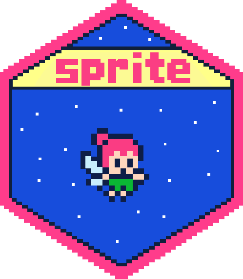

.. sprite documentation master file.

.. raw:: html

   
<h1>sprite 0.1.0</h1>

What is sprite?
===============

``sprite`` is a command line interface for building
sparse population depth-mask BED files. It answers a practical cohort question:
for each genomic interval, how many samples in each population have enough
depth to pass a chosen threshold?

The tool can build the same final ``sprite.bed.gz`` output from two
input modes:

* BAM/CRAM alignments, using ``mosdepth`` to quantize each sample and
  ``bedtools multiinter`` to combine samples.
* A prefiltered all-sites VCF, using per-sample ``FORMAT/DP`` values directly.

The output is a bgzipped and tabix-indexed BED. Intervals absent from the file
are interpreted as zero passing samples for every population, so large cohorts
and large target sets can stay compact when most sites do not pass.

.. toctree::
   :caption: Documentation
   :maxdepth: 2

   about
   installation
   arguments
   inputs
   examples
   output

.. toctree::
   :caption: Reference
   :maxdepth: 2

   development
   api
   changelog
